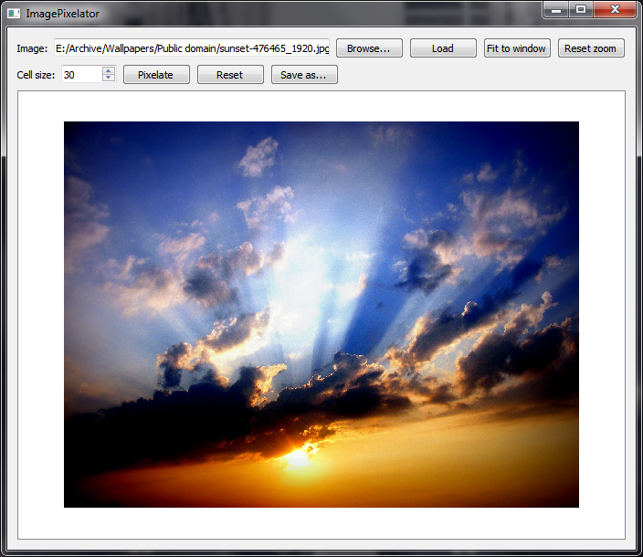
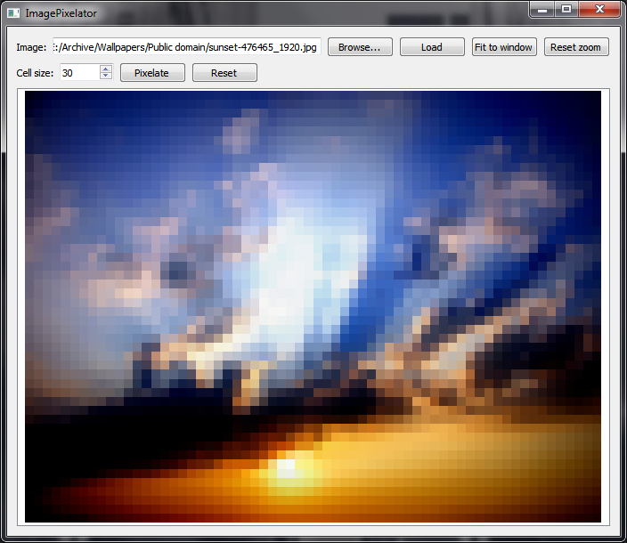

# ImagePixelator
Program for pixelating images with a customizable cell size. Written in Qt/C++.

## Download

Download link: [Win32 binary](https://github.com/Extender/ImagePixelator/raw/master/bin/imagepixelator-v1.0-bin-win32.zip)

## Screenshots

### Input

### Output

